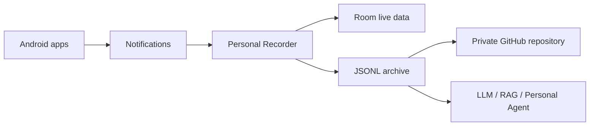

# Personal Recorder

[English](README.md) | [简体中文](README.zh-CN.md)

Personal Recorder is a local-first Android notification recorder. It collects notification events on the device, keeps the live dataset in Room, and can write long-term JSONL archives. A private GitHub repository is an optional remote archive and restore source; the Room database is never uploaded.

> Turn Android notifications into a private, searchable, AI-ready personal activity log.

## Download

Download the latest signed APK from [GitHub Releases](https://github.com/Tuzfucius/PersonalRecorder/releases).

GitHub Releases contain two kinds of signed APKs:

- `vMAJOR.MINOR.PATCH` releases are stable versions confirmed by a maintainer.
- `weekly-YYYY.MM.DD` releases are automatic Pre-releases from the latest `main` changes.

Both include a SHA-256 checksum. Actions artifacts are development/test Debug builds; GitHub Releases are the installable signed releases for end users.

Your phone already receives a continuous stream of information about your work and daily life: messages, email alerts, calendar reminders, GitHub activity, deliveries, payments, travel updates, and system notices. Most of it is read once and then disappears into individual apps.

Personal Recorder captures that notification stream locally on Android and turns it into structured history you can keep, review, archive, and reuse later.

The project itself does **not** require an LLM and does **not** automatically send your notifications to an AI service. Its job is to preserve the data cleanly. When you want, the exported JSONL archive can be provided to ChatGPT, Claude, Gemini, a local model, a RAG pipeline, or a personal agent for further analysis.

**Archive it today. Ask an AI about it tomorrow.**

## What can you do with it?

After collecting a day of notifications, you can use the archive as context for questions such as:

- What important information did I receive today?
- Which tasks or reminders still need my attention?
- Summarize today's work-related notifications.
- Did I miss any deadlines, meetings, review requests, or delivery updates?
- Which apps generated most of my interruptions this week?

Personal Recorder is intentionally small: it focuses on building a reliable personal event archive instead of embedding a specific AI provider into the app.

## Why notifications?

Notifications are one of the few information streams that Android already aggregates across otherwise unrelated apps. Gmail, messaging apps, calendars, developer tools, logistics services, and many other applications expose different APIs, but their important updates often converge in the Android notification system.

That makes notifications a practical input layer for building a personal information history without integrating with every service individually.



## Privacy first

- Notification collection happens locally on the Android device.
- Room remains the live on-device database and is not uploaded.
- Remote archive synchronization is optional.
- The supported remote archive is a GitHub private repository controlled by the user.
- Notification data is not automatically sent to any LLM.
- Archive files are not end-to-end encrypted by Personal Recorder, so repository access control still matters.

## Screenshots

The current app provides three main views: browsing captured events, understanding notification patterns, and managing archive/background settings.

| Records | Statistics | Settings |
| --- | --- | --- |
| Browse recent notifications and today's event stream. | See hourly distribution, app sources, rankings, and longer-range trends. | Configure GitHub archive, synchronization, restore, and background diagnostics. |
|  |  |  |

The screenshots come from the Debug APK. Notification contents and account/repository identifiers were redacted before committing.

## Features

### Capture

- Collect notifications through Android `NotificationListenerService`.
- Filter ongoing notifications and group summaries from statistics.
- Filter apps with allowlist/blocklist modes.
- Keep recent events available for local review.

### Understand

- Statistics for today, the last 7 days, and the last 30 days.
- Fixed 24-hour stacked chart showing which applications generated notifications at each hour.
- Application source breakdown and ranking.
- Date/hour/application filtering for detailed inspection.

### Archive

- Room is the realtime local data source.
- Notification history can be exported into portable half-day JSONL archives.
- Daily manifests describe available archive segments.
- Archives can later be read by scripts, LLM tooling, RAG systems, or personal automation pipelines.

### Sync and restore

- Optional synchronization to a user-controlled GitHub private repository.
- Restore archived history to another device.
- Conflict detection and review instead of silent overwrite.
- Background synchronization and runtime diagnostics.

### Localization

- English and Simplified Chinese UI resources.
- The Android system locale selects the interface language automatically.
- Locale-aware dates and quantity formatting.

## Using an archive with an LLM

Personal Recorder currently stops at **capture + archive**. AI analysis is an external workflow, which keeps the recorder independent of any model vendor.

A simplified archive might contain events like:

```json
{"timestamp":"2026-08-24T09:15:00","app":"Gmail","title":"Project meeting","content":"Meeting moved to 15:00"}
{"timestamp":"2026-08-24T10:02:00","app":"GitHub","title":"Pull request review requested"}
{"timestamp":"2026-08-24T12:20:00","app":"Calendar","title":"Lab deadline tomorrow"}
```

You can then provide the relevant archive to an LLM with a prompt such as:

```text
Summarize today's important notifications.
Extract actionable tasks, deadlines, meetings, and items that may still require a response.
Group the result by urgency and source application.
```

The model or agent layer is deliberately separate from Personal Recorder. You decide what data to share, which model to use, and whether analysis happens locally or remotely.

## Data and synchronization

Room is the live on-device source. The archive writer exports JSONL files grouped by half day, while daily manifests describe the available archive parts. GitHub synchronization is optional and uses a private repository as an archive and restore endpoint.

Restore keeps local data separate until conflicts are resolved. Synchronization does not upload the Room database and does not change notification collection rules.

## Build and run

```powershell
.\gradlew.bat test
.\gradlew.bat assembleDebug
.\gradlew.bat connectedDebugAndroidTest
```

Install `app/build/outputs/apk/debug/app-debug.apk` on an Android device and grant notification access. GitHub configuration is only required if you want remote archive synchronization and restore.

### Weekly builds

Every Monday at 00:00 Hong Kong time, GitHub Actions checks whether `main` received commits during the previous seven days. If there are no changes, no APK or Pre-release is created. When changes exist, Actions builds a signed APK and publishes a `weekly-YYYY.MM.DD` Pre-release; rerunning the same day updates its assets.

Weekly builds use the same signing key as stable releases, so a later stable release can upgrade a Weekly APK. The version name is based on the latest stable Tag, for example `1.0.0-weekly.20260824`. Before the first stable Tag, the fallback base is `1.0.0`.

### Creating a release

Push a semantic version tag:

```bash
git tag v1.0.0
git push origin v1.0.0
```

GitHub Actions will run tests, build and sign the Release APK, verify its signature, and publish it with a SHA-256 checksum.

### Release signing (maintainers)

Configure these GitHub Actions repository secrets under **Settings -> Secrets and variables -> Actions**:

```text
RELEASE_KEYSTORE_BASE64
RELEASE_KEYSTORE_PASSWORD
RELEASE_KEY_ALIAS
RELEASE_KEY_PASSWORD
```

The same Android signing key must be kept and reused for all later versions so users can install updates over the existing app. Never commit the keystore or its encoded contents to the repository.

Stable `versionCode` reserves 999 Weekly slots per semantic version:

```text
stable versionCode = (MAJOR * 10000 + MINOR * 100 + PATCH) * 1000
Weekly versionCode = stable versionCode + commits since the stable Tag
```

Before the first stable Tag, Weekly `versionCode` uses the repository commit count and must stay within `1..999`. Publish a new stable Tag before the reserved Weekly range is exhausted.

## Limitations

- Android notification access and OEM battery policies can affect collection reliability.
- Background work remains subject to Android and manufacturer scheduling limits.
- GitHub sync requires network access and a configured private repository.
- Some applications may expose only part of their underlying content through notifications.
- Personal Recorder does not currently include built-in LLM analysis or an in-app AI assistant.
- There is no in-app language switcher; the Android system locale selects resources.

## Roadmap

- Improve archive inspection and conflict review workflows.
- Add more detailed diagnostics for OEM background restrictions.
- Make exported archives easier to feed into LLM, RAG, and personal-agent workflows.
- Continue expanding locale coverage and accessibility validation.
