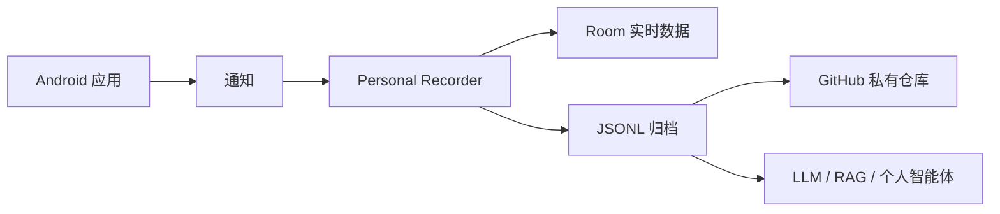
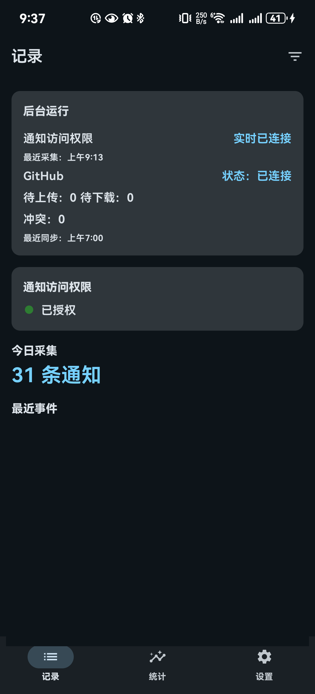
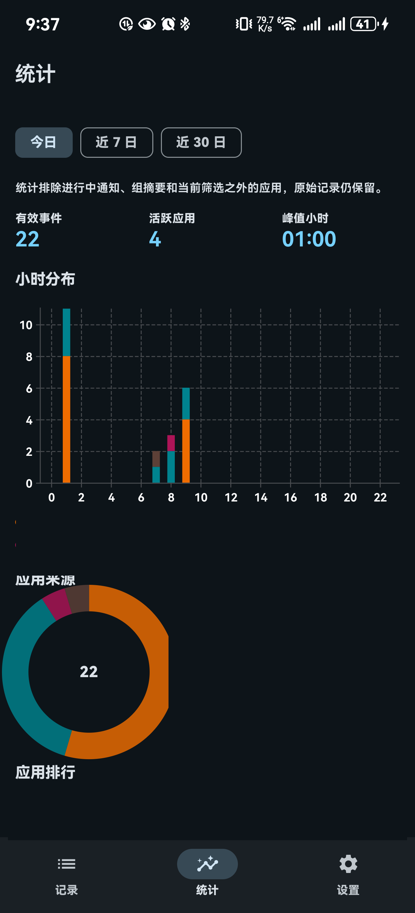
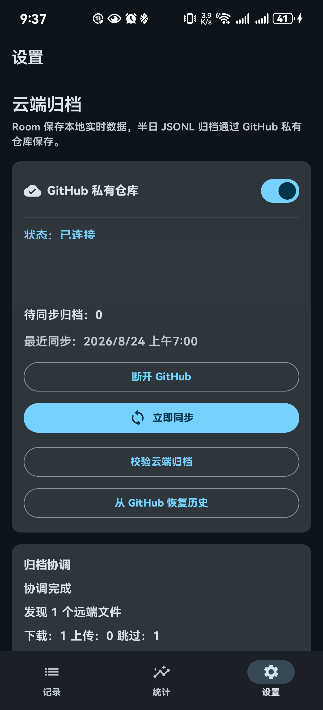

# Personal Recorder

[English](README.md) | [简体中文](README.zh-CN.md)

> 把 Android 通知自动沉淀为私有、可检索、可供 AI 分析的个人信息档案。

你的手机每天都在持续接收关于工作和生活的信息：聊天消息、邮件提醒、日程会议、GitHub 动态、快递、支付、出行以及系统通知。大多数信息看过一次之后，就重新散落回不同的应用里。

Personal Recorder 在 Android 本地持续采集这条通知信息流，把它转化为可以长期保存、回看、归档并再次利用的结构化历史数据。

这个项目本身**不依赖大语言模型**，也**不会自动把你的通知发送给任何 AI 服务**。它首先负责把数据可靠地留下来。之后，如果你需要，可以把导出的 JSONL 归档交给 ChatGPT、Claude、Gemini、本地模型、RAG 系统或者个人智能体继续分析。

**今天把信息留下来，之后再让 AI 帮你理解它。**

## 它能做什么？

收集一天的通知之后，你可以把归档作为上下文，让大语言模型回答这类问题：

- 我今天收到了哪些重要信息？
- 还有哪些任务或提醒需要我处理？
- 总结今天所有与工作有关的通知。
- 有没有漏掉的截止时间、会议、代码审查请求或者物流更新？
- 最近一周哪些应用对我的注意力打扰最多？

Personal Recorder 故意保持轻量：它专注于建立可靠的个人事件档案，而不是在应用内部绑定某一家 AI 服务。

## 为什么从通知开始？

Android 通知是手机上少数已经被系统统一聚合的信息流之一。Gmail、即时通讯、日历、开发工具、物流服务等应用拥有完全不同的数据接口，但它们的重要变化往往最终都会汇聚到 Android 通知系统。

因此，不必逐一接入每一种服务，也可以先通过通知建立一份跨应用的个人信息历史。



## 隐私优先

- 通知采集完全在 Android 设备本地完成。
- Room 是设备上的实时数据库，不会被上传。
- 远端归档同步完全可选。
- 当前支持的远端归档由用户自己的 GitHub 私有仓库承载。
- 通知数据不会自动发送给任何大语言模型。
- Personal Recorder 不对归档文件提供端到端加密，因此 GitHub 仓库访问权限仍然非常重要。

## 功能截图

当前应用主要提供三个页面：查看采集到的事件、理解通知分布，以及管理归档和后台运行配置。

| 记录 | 统计 | 设置 |
| --- | --- | --- |
| 查看最近通知和当天的信息流。 | 查看小时分布、应用来源、排行和更长时间范围的趋势。 | 配置 GitHub 归档、同步、恢复和后台运行诊断。 |
|  |  |  |

截图来自当前 Debug APK。提交前已对通知正文以及账号、仓库标识进行了打码。

## 功能

### 采集

- 通过 Android `NotificationListenerService` 采集通知。
- 统计时过滤 ongoing 通知和群组摘要。
- 支持应用允许列表和排除列表。
- 在本地查看最近事件。

### 理解

- 支持今日、近 7 天和近 30 天统计。
- 固定 24 小时堆叠图，显示每个小时分别由哪些应用产生通知。
- 应用来源分布和应用排行。
- 可按日期、小时和应用筛选并查看明细。

### 归档

- Room 是本地实时数据源。
- 通知历史可以导出为可迁移的半日 JSONL 归档。
- 每日 manifest 描述当天已有的归档分片。
- 后续可以使用脚本、大语言模型、RAG 或个人自动化流程继续处理这些归档。

### 同步与恢复

- 可选同步到用户自己控制的 GitHub 私有仓库。
- 支持在其他设备上恢复历史归档。
- 检测归档冲突并要求处理，而不是静默覆盖。
- 提供后台同步和运行状态诊断。

### 中英文界面

- 提供英文和简体中文资源。
- 根据 Android 系统语言自动选择界面语言。
- 日期和数量格式遵循当前系统区域设置。

## 把归档交给大语言模型分析

Personal Recorder 当前的边界是 **采集 + 归档**。AI 分析属于外部流程，这样记录器本身不依赖任何特定模型厂商。

一份简化后的归档可能包含：

```json
{"timestamp":"2026-08-24T09:15:00","app":"Gmail","title":"Project meeting","content":"Meeting moved to 15:00"}
{"timestamp":"2026-08-24T10:02:00","app":"GitHub","title":"Pull request review requested"}
{"timestamp":"2026-08-24T12:20:00","app":"Calendar","title":"Lab deadline tomorrow"}
```

你可以把相关日期的归档交给大语言模型，并使用类似提示词：

```text
总结我今天收到的重要通知。
提取仍需处理的任务、截止时间、会议和可能需要回复的事项。
按照紧急程度和来源应用进行分类。
```

模型或智能体层与 Personal Recorder 保持分离。由用户自己决定分享哪些数据、使用哪个模型，以及分析是在本地还是远端完成。

## 数据与同步

Room 是设备上的实时数据源。归档器按半日导出 JSONL 文件，每日 manifest 描述当前已有的归档分片。GitHub 同步是可选功能，使用私有仓库作为归档和恢复端点。

恢复流程会在冲突解决前保留本地数据。同步不会上传 Room 数据库，也不会改变通知采集规则。

## 构建与运行

```powershell
.\gradlew.bat test
.\gradlew.bat assembleDebug
.\gradlew.bat connectedDebugAndroidTest
```

将 `app/build/outputs/apk/debug/app-debug.apk` 安装到 Android 设备，并授予通知访问权限。只有需要远端归档同步和恢复时才需要配置 GitHub。

## 限制

- Android 通知访问权限和厂商电池策略会影响采集可靠性。
- 后台任务仍然受 Android 和设备厂商调度策略限制。
- GitHub 同步需要网络连接并配置私有仓库。
- 部分应用通过通知暴露的信息可能只包含其原始内容的一部分。
- Personal Recorder 当前没有内置大语言模型分析或应用内 AI 助手。
- 当前没有应用内语言切换器，界面语言由 Android 系统区域设置决定。

## 路线图

- 改进归档检查和冲突审阅流程。
- 增加针对 OEM 后台限制的诊断信息。
- 让导出的归档更容易接入 LLM、RAG 和个人智能体工作流。
- 持续扩展本地化覆盖和无障碍验证。
